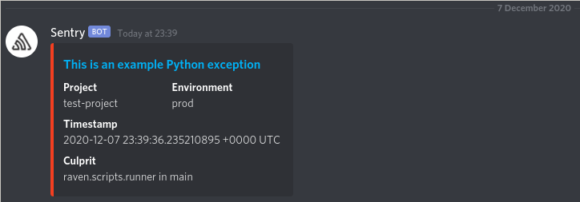
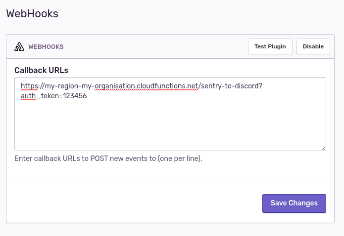

# sentry-to-discord

🚨 A simple Google Cloud Function in Go to transform / proxy Sentry webhooks to Discord.

It is an alternative to using Slack (Legacy) which may not work anymore.

_This project has been tested with the Go 1.13 runtime._

## Getting Started

### Prerequisites

- Ensure you have `gcloud` installed:
    - MacOS: `brew cask install google-cloud-sdk`
    - Others: https://cloud.google.com/sdk/gcloud
- Ensure you have authenticated with Google Cloud: `gcloud init`
- (Optional) Set your current working project: `gcloud config set project <project>`

### Deployment

1. Clone / download a copy of this repository
2. Copy `.env.sample.yaml` to `.env.yaml`, and modify the environment variables declared in the file
3. Run `./deploy.sh`
4. Configure Sentry webhooks integration in `https://sentry.io/settings/<organisation>/plugins/webhooks/`

_Be sure to append `?auth_token=<AUTH_TOKEN>` to the end of the URL under `httpsTrigger` (returned in the output from (3)). e.g. https://my-region-my-organisation.cloudfunctions.net/sentry-to-discord?auth_token=123456._

